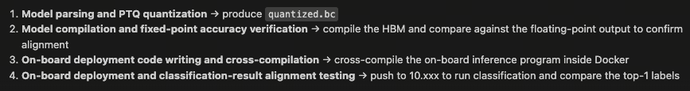
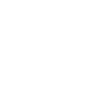
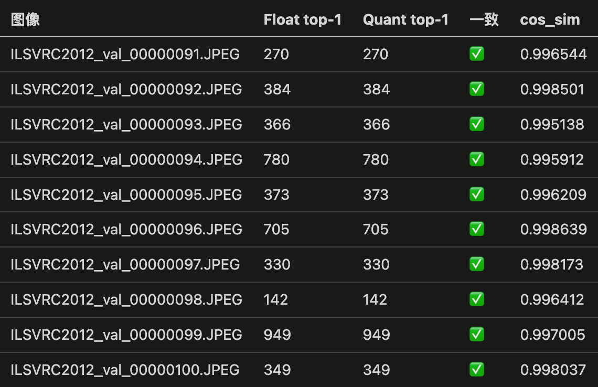
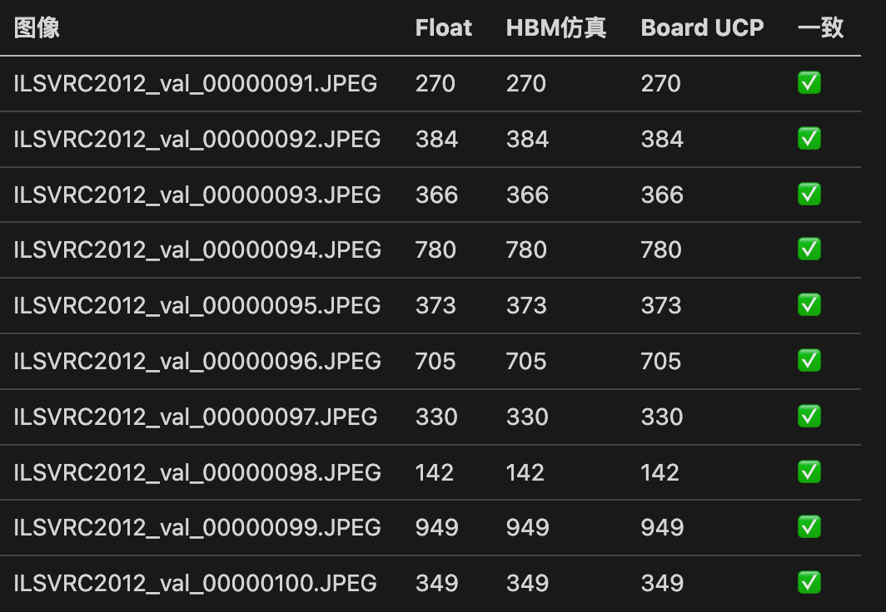

Since some large models have limited context windows, and full-process deployment scenarios involve long chains, it is possible to exceed the maximum context length and cause execution to stall. Moreover, when the context becomes too long, large models may lose focus, waver in execution, overreact to anomalies, omit important details arbitrarily, and increase hallucination. Therefore, it is common to observe that when too many tasks are packed into a single prompt, the agent tends to degrade in performance. To improve effectiveness and ensure the accuracy and stability of agent execution, we recommend that users adopt a scientific plan, periodically guide the agent to refocus, and manually review and confirm critical steps and configurations.

Below we share an approach that uses hierarchical planning followed by phased execution. This significantly improves the agent's performance on complex tasks while making it easier for humans to monitor and correct deviations during execution. This is just a reference, if you have better methods, we welcome you to share them so we can learn from each other.

1. Process Planning: Guide the agent to refer to oe-skills and only list 3–5 coarse-grained stages, such as “Environment Setup → Quantization Adaptation → Accuracy Tuning → Performance Evaluation → Model Deployment”.

2. Detailed Sub-stage Plan: Before starting each sub‑stage, have the agent generate a detailed breakdown of sub‑steps based on the top‑level plan. Require it to decompose the execution process in detail, with each step focusing on one key action, and list the specific skills/documents to reference, as well as the key APIs to call.

3. Phased Execution: Execute each stage in a separate session, using the outputs from the previous stage and the plan for the current stage. Require a summary report after each step.

## Process Planning

```plain&#x20;text
"You are a task planning expert. I will give you a task. Please break down the process of achieving this goal into 3–5 high‑level plans. Describe each stage in one sentence without providing sub‑steps or technical details. However, you must record some rules that must be followed throughout the entire task. Output the plan in .md format and place it under the 'plan' subfolder of the working path, so that subsequent stages can refer to your plan smoothly. If you understand, please prompt me to enter the task description."

output
Understood. Please tell me your task description, and I will break it down into 3–5 high‑level stages and record the key rules.

"I want to quantize and deploy an ONNX classification model on Horizon J6E, write deployment code, cross‑compile it in a container, push it to the development board {BOARD_IP}, and test whether the classification results align with the floating‑point model.
The docker container for testing is ****.
The working directory is /open_explorer/work_dir/. Do not read any files outside this directory.
The model path in the container is: /open_explorer/work_dir/models/resnet50.onnx.
Calibration data is located at: /open_explorer/work_dir/data/calibration_data_rgb.
Preprocessing code: the function get_data_loaders() in /open_explorer/work_dir/resnet50.py."
```

The high-level plan overview is shown below:



The generated deployment plan should also confirm that it includes correct global rules (at a minimum, it should specify the runtime environment, working path, data, task objectives, and special deployment requirements).

> Tips: Since full‑process deployment includes necessary steps such as ONNX model conversion, inference code writing, cross‑compilation, and on‑board inference execution, users must prepare the PC development environment and the board IP in advance to prevent the large model from going off track.
>
> Because the agent may use non‑interactive methods such as `docker exec` to enter the container, which may prevent automatic loading of `.bashrc`, resulting in missing cross‑compilation tools and CMake, it is advisable to remind the agent that the CMake and cross‑compilation tool paths are written in the container's configuration file: `/etc/bash.bashrc`, or to instruct it to use `docker run -it` to enter interactively.

## Sub‑stage Plan

```plain&#x20;text
Next, break down the sub‑plan for each stage. Each step in the sub‑plan should be a concrete, immediately executable action. Requirements: 1. Keep the number of steps between 5 and 10. 2. Describe each step in one sentence, containing only one clear action. 3. Include the skills or documents to reference, as well as the key APIs to use.
```

1. Model Parsing and PTQ Quantization

For this stage, it is recommended to directly guide the agent to refer to `j6-hmct-cosine-similarity-tuning` to design the plan (without using other tools for unnecessary attempts), focusing primarily on accuracy tuning. The execution flow of this skill can be referenced from the flowchart below:



> ⚠️ Note that the current initial quantization configuration for this skill is:
>
> ```json
> quant_config = {
>     "model_config": {"all_node_type": "int8"}   # node_config={}, op_config={}
> }
> ```
>
> When `calibration_type` is not specified, `modelwise search` is enabled by default. If your model is large or the calibration data is extensive, and you find that the calibration stage runs for a very long time, it is recommended to guide the agent to use max calibration and skip the search step: `"activation": {"calibration_type": "max"}`.
>
> ⚠️ Additionally, if you already have prior accuracy configurations and they use `subgraph_config` or `op_config`, the current automatic accuracy tuning skill does not support parsing such configurations. In that case, guide the agent to help you convert them to `node_config`.

2. Model Compilation and Fixed‑point Accuracy Verification

Model Compilation: If the agent deviates by using tools such as `hb_compile` based on user manuals or historical information, guide it to revise the plan and use `j6-hbdk-compile` to compile the previous output `ptq_model.onnx`.

Fixed‑point Accuracy Verification: If you do not have a directly connected development board, guide the agent to instead use `quantized.bc` (which has the same binary output as HBM) to run a few key cases for visualization. If a development board is available, the agent will invoke `j6-ucp-hbm-infer` to write hbm\_infer code or use the `hb_verifier` tool for consistency verification.

> Please note that if the development board is unreachable, do not let the agent use hbm\_infer to run HBM inference locally, as it will be extremely slow.

3. On‑board Deployment Code Writing and Cross‑compilation

This process primarily refers to the `j6-ucp-infer-generating` skill. Normally, the agent will proactively help design a smoke test to compare the deployment code with the Python‑side consistency. If not, guide it to supplement this step.

If no development board is available, guide the agent to use `quantized.bc` to compile an executable program on the X86 side for verifying the correctness of the UCP code.

## Phased Execution

> If you notice that the agent spends a long time debugging during use, you can prompt it to use Horizon‑provided skills to improve efficiency. Example dialogue: It is recommended to check the skills under .horizon.

Based on the detailed plans above, the agent completed quantization tuning, model compilation, on‑board code writing, and consistency verification in about 10 minutes.





