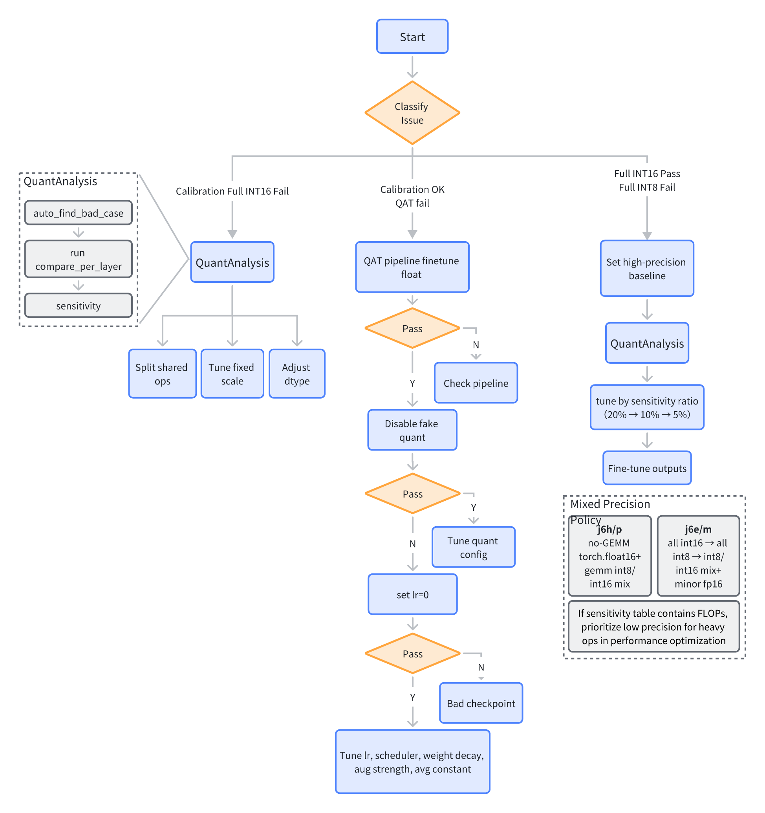

Since some large models have limited context windows, and full-process deployment scenarios involve long chains, it is possible to exceed the maximum context length and cause execution to stall. Moreover, when the context becomes too long, large models may lose focus, waver in execution, overreact to anomalies, omit important details arbitrarily, and increase hallucination. Therefore, it is common to observe that when too many tasks are packed into a single prompt, the agent tends to degrade in performance. To improve effectiveness and ensure the accuracy and stability of agent execution, we recommend that users adopt a scientific plan, periodically guide the agent to refocus, and manually review and confirm critical steps and configurations.

Below we share an approach that uses hierarchical planning followed by phased execution. This significantly improves the agent's performance on complex tasks while making it easier for humans to monitor and correct deviations during execution. This is just a reference, if you have better methods, we welcome you to share them so we can learn from each other.

1. Process Planning: Guide the agent to refer to oe-skills and only list 3-5 coarse-grained stages, such as “Environment Setup → Quantization Adaptation → Accuracy Tuning → Performance Evaluation → Model Deployment”.

2. Detailed Sub-stage Plan: Before starting each sub-stage, have the agent generate a detailed breakdown of sub-steps based on the top-level plan. Require it to decompose the execution process in detail, with each step focusing on one key action, and list the specific skills/documents to reference, as well as the key APIs to call.

3. Phased Execution: Execute each stage in a separate session, using the outputs from the previous stage and the plan for the current stage. Require a summary report after each step.

## Process Planning

```plain&#x20;text
You are a task planning expert. I will give you a task. Please break down the process of achieving this goal into 3-5 stages. Describe each stage in one sentence without providing sub-steps or technical details. However, you must record some rules that must be followed throughout the entire task. Output the plan in .md format and place it under the 'plan' subfolder of the working path, so that subsequent stages can refer to your plan smoothly.

Task description: I want to deploy yolov5s on the Horizon J6P platform. Please help me create a new conda environment, perform model quantization (including calibration, QAT, and export), accuracy tuning, model compilation, HBM accuracy verification, and UCP code writing.
Final requirements: HBM accuracy loss should not exceed 1% compared to the floating-point model, and the measured latency on the dev board 10.xx.xx.xx should be controlled within 5 ms.
Working path: /workspace/00_yolov5. Please create a new folder tmp_output for all deployment-related artifacts, and do not affect the original code.
Working environment: newly created conda environment, GPU cards 3 and 4 are available.
Calibration dataset path: /data/orig_data/mscoco/.
```

The generated deployment plan should confirm that it includes correct global rules (at a minimum, it should specify the runtime environment, working path, data, task objectives, and special deployment requirements). In addition, confirm that the task description for each stage has no obvious errors, such as quantization tools, basic quantization configuration, execution steps, etc.

1. Quantization tool: For PyTorch models, `horizon_plugin_pytorch` should be used for quantization adaptation. Do not fall back to exporting ONNX and using HMCT quantization due to any exceptions, unless explicitly permitted by the user.

2. Basic quantization configuration: J6E/M should use full int8, while J6H/P should use fp16 + int8.

Based on the above prompt, five stages were identified: Environment Setup, Model Preparation and Plugin Quantization Adaptation, Accuracy Tuning, Export/Compilation and HBM Accuracy Verification, and UCP Deployment Code Writing.

## Detailed Sub-stage Plan

```plain&#x20;text
Based on the top-level plan and referring to .horizon/HORIZON.md, sequentially break down the detailed sub-plans for each stage before execution. Each step in the sub-plan should be a concrete, immediately executable action. Requirements: 1. Keep the number of steps between 5 and 10. 2. Describe each step in one sentence, containing only one clear action. 3. Include the skills or documents to reference, as well as the key APIs to use.

OE development package path: /package/02_OE/horizon_j6_open_explorer_{version}
```

1. Environment Setup

It is recommended to perform the following checks:

* In addition to the necessary dependencies for the floating-point model, the PyTorch quantization environment should at least include the quantization tools `horizon_plugin_pytorch` and `horizon_plugin_profiler`, the compilation tool `hbdk4-compiler`, the performance evaluation tool `hbdk4-runtime`, and the HBM accuracy evaluation tool `hbm_infer`. Check the packages the agent plans to install, if it intends to install non-essential packages such as `horizon-tc-ui`, instruct it to skip installation if dependency conflicts arise, and only install the four essential tool packages.

* `horizon_plugin_pytorch` supports only a limited set of torch versions. The current OE development package provides only torch 2.3, 2.6, 2.8, and 2.10.0. Based on the floating-point model requirements, guide the agent to restrict torch installation to these four versions.

* Current OE supports only Python 3.10 and 3.11. Ensure the agent restricts the conda environment to these two versions.

2. Model Preparation and Plugin Quantization Adaptation

For quantization adaptation, verify that the plan calls three skills in sequence: the adaptation skill `j6-plugin-adaptation`, the adaptation check skill `j6-plugin-model-check-result`, and the model export skill `j6-plugin-export`.

1. Brief introduction to the `j6-plugin-adaptation` skill:

* This skill contains five sub-skills underneath.

2. Brief introduction to the `j6-plugin-model-check-result` skill:

* This skill mainly performs anomaly checks in the following five aspects.

3. Brief introduction to the `j6-plugin-export` skill:

* This skill constructs a standalone `export.py` file. It does not add export logic to the training/evaluation scripts, does not modify the model structure or qconfig, and loads the quantized weights generated in the previous steps. During the export process, it checks that the model correctly includes FakeQuantize modules.

3. Accuracy Tuning

For accuracy tuning, verify that the steps in the plan strictly follow the accuracy tuning skill:



For more complex models, some manual configurations (such as fixing scales, fp32 configurations, etc.) are still required to avoid wasting too much time and tokens on automatic tuning, which may not yield a usable model.

4. Export/Compilation and HBM Accuracy Verification

* Export/Compilation: The agent may choose `j6-plugin-hbdk-generating` to help generate basic compilation code (which by default removes all quantization/dequantization nodes). However, if you need to convert inputs to pyramid/resizer, or perform more complex node removal tasks (e.g., removing all quantization nodes but not altering homo-offset related nodes), guide the agent to use `j6-hbdk-compile`, which supports more complex compilation scenarios.

* HBM Accuracy Verification: If you do not have a directly connected development board, or if full-dataset accuracy testing would take too long, guide the agent to use `quantized.bc` (which has the same binary output as HBM) to run a few key cases for visualization. If a development board is available, the agent will invoke `j6-ucp-hbm-infer` to write hbm\_infer code.

> Please note that if the development board is unreachable, do not let the agent use hbm\_infer to run HBM inference locally, as it will be extremely slow.

5. UCP Deployment Code Writing

It is recommended to add a single-sample consistency check against the Python side during the deployment code writing process (the Python side can use quantized.bc or hbm\_infer, depending on the previous step).

If no development board is available, guide the agent to use quantized.bc to compile an executable program on the X86 side for verifying the correctness of the UCP code.

The skill to be called for UCP code generation should be `j6-ucp-infer-generating`.

## Phased Execution

```plain&#x20;text
Please refer to the project plan: deployment_plan.md and the phase-2 plan phase2_precision_tuning.md to complete model accuracy tuning.
```

We will not elaborate on the specific execution phases. In the end, after about 3 hours, the agent completed environment setup, quantization adaptation, accuracy tuning, model compilation, HBM accuracy evaluation, deployment code generation, and consistency verification between the board side and the X86 side.


