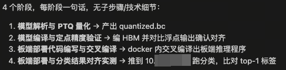
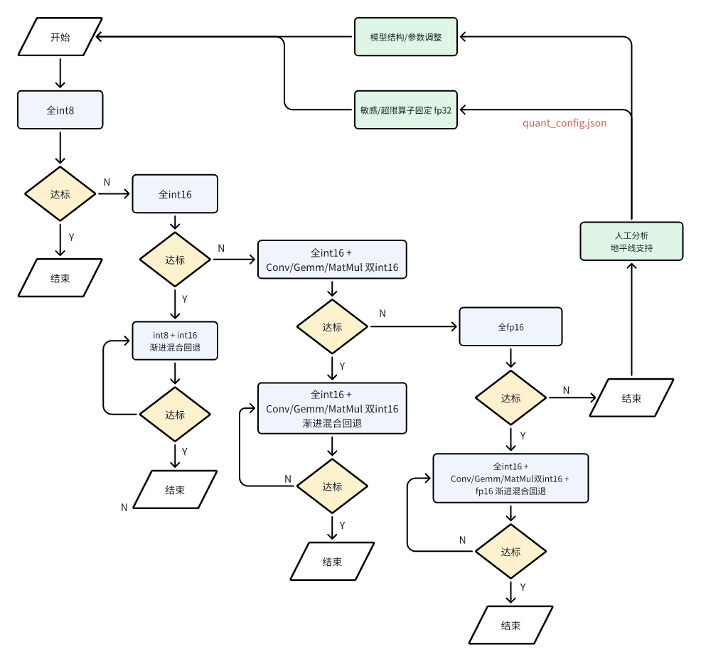

由于部分大模型上下文有限，而全流程部署场景的链路较长，可能存在超过上下文最大长度限制导致无法继续运行的问题。此外，若上下文过长，大模型有可能出现遗忘目标，执行摇摆不定，对异常过度反应，胡乱省略和幻觉增加等问题，因此大家常会发现在一条prompt里塞进过多任务时，agent往往会越跑越降智。为了提升使用效果，保证agent执行结果的准确性和稳定性，建议大家使用过程中应通过制定科学的计划，定期引导agent重新聚焦，并对关键步骤&配置做人工审核和确定。

如下分享我们采用分层规划再分阶段执行的方式，可显著提升agent对复杂任务的执行效果，同时让执行过程中人工更方便监督和纠偏，思路仅供参考，若有更好的方法欢迎大家多多分享互相借鉴：

1. 流程规划：引导agent参考oe-skills后仅列出 3\~5 个粗粒度的阶段，比如“环境搭建 -> 量化适配 -> 精度调优 -> 性能评测 -> 模型部署”。

2. 子阶段详细 Plan：每开始执行子阶段前，让agent依据顶层Plan，为该子阶段生成细化的子步骤。应要求其将执行过程做详细拆解，每一步聚焦一个关键动作，并列出具体参考的skill/文档，调用的关键api。

3. 分阶段执行：每个阶段单独开启一个会话，依据前一个阶段产出物和本阶段的计划进行执行，并要求每一步执行结束后写总结报告。

## 1. 流程规划

```plain&#x20;text
"你是一个任务规划专家。我会给你一个任务，请将达成该目标的过程拆分为 3~5 个概略计划，每个阶段用一句话描述，无需给出子步骤和技术细节，但需要记录一些整个任务都要遵守的规则，输出格式为.md并存放到工作路径的子文件夹plan下面，便于后续阶段参照你的计划顺利开展。如果明白的话，请提示我输入相关任务描述"

output
明白。请告诉我你的任务描述，我将为你拆分为 3～5 个概略计划阶段，并记录关键规则

"我要在地平线 J6E 上量化部署一个 ONNX 分类模型，编写部署代码，在容器中交叉编译后推到到开发板{BOARD_IP}上测试一下分类结果是否可与浮点模型对齐。
测试的docker容器为****，
工作目录放在 /open_explorer/work_dir/下，不要阅读该目录以外的文件。
模型路径在容器的：/open_explorer/work_dir/models/resnet50.onnx，
校准数据位于：/open_explorer/work_dir/data/calibration_data_rgb。
预处理代码：/open_explorer/work_dir/resnet50.py函数get_data_loaders()。"
```

计划概览如下：



产出的部署计划中，还应确认其包含正确的全局规则（应至少规定运行环境，工作路径，数据，任务目标，特殊的部署要求等）。

> tips：由于全流程部署包含onnx模型的转换，推理代码的编写，交叉编译以及板端执行推理等必要的步骤。需要用户提前准备好pc上的开发环境，以及板端的IP。防止大模型在推理过程中跑偏。
>
> 由于agent可能使用docker exec等非交互式的方式进入docker，导致不会自动加载.bashrc出现找不到交叉编译工具和cmake的问题，建议可以提示agent，cmake以及交叉编译工具路径都写在了docker的配置文件里：/etc/bash.bashrc，或提示其用docker run -it进入。

## 2. 子阶段 Plan

```plain&#x20;text
接下来拆解每个阶段的子计划，子计划中每个步骤应是可立即执行的具体动作。要求：1. 步骤数量控制在 5~10 个 2.每步用一句话描述，只包含一个明确动作 3.需要包含应参考的skill或文档，以及使用的关键api。
```

1. **模型解析与PTQ量化**

针对该阶段建议直接引导agent参考`j6-hmct-cosine-similarity-tuning`设计该阶段的计划（无需使用其他工具做多余的尝试），重点聚焦在精度调优上。该skill的执行流程可参考如下流程图：



> ⚠️需要注意的是，当前该skill起始量化配置为：
>
> ```json
> quant_config = {
>     "model_config": {"all_node_type": "int8"}   # node_config={}, op_config={}
> }
> ```
>
> 未指定`calibration_type`的情况下会默认开启`modelwise search`，若您的模型较大或者校准数据较多的情况下，发现校准阶段运行时间很长，建议引导agent使用max校准，跳过搜索步骤：`"activation": {"calibration_type": "max"}`
>
> ⚠️ 此外，若您已有先验精度配置，且采用的是`subgraph_config`或者`op_config`配置，当前自动精度调优skill还不支持解析这类配置，建议引导agent帮您转换为`node_config`。

2. **模型编译与定点精度验证**

**模型编译**：若agent参考用户手册或历史信息跑偏使用hb\_compile等工具的话，建议引导agent改写计划使用`j6-hbdk-compile`来编译上一步的产物`ptq_model.onnx`。

**定点精度验证**：若您没有可直连的开发板，可引导agent改用quantized.bc（与hbm输出二进制一致）跑几个关键case的可视化。若有可用的开发板，则agent会调用`j6-ucp-hbm-infer`编写hbm\_infer代码或者使用`hb_verifier`工具进行一致性验证。

> 请注意，若开发板不可达，请不要让agent使用hbm\_infer在本地推理hbm，速度非常慢。

3. **板端部署代码编写与交叉编译**

该流程主要参考`j6-ucp-infer-generating`这个skill。正常情况下agent都会主动帮忙设计冒烟测试对比部署代码与python端的一致性，若无，则建议引导其补充。

若无可使用的开发板，可引导agent基于quantized.bc，在x86端编译可执行程序进行ucp代码的正确性验证。

## 3. 分阶段执行

> 如果发现使用过程中发现agent存在长时间调试的情况。可以在交互时提示agent使用地平线提供的skill，提升效率，示例对话：**建议查看.horizon的skill**。

基于前面详细的计划，agent大概花了10分钟的时间就完成了量化调优，模型编译，板端代码编写以及一致性验证的工作。


