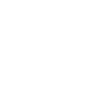
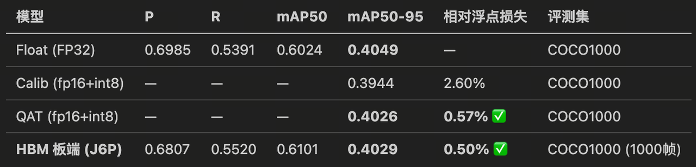
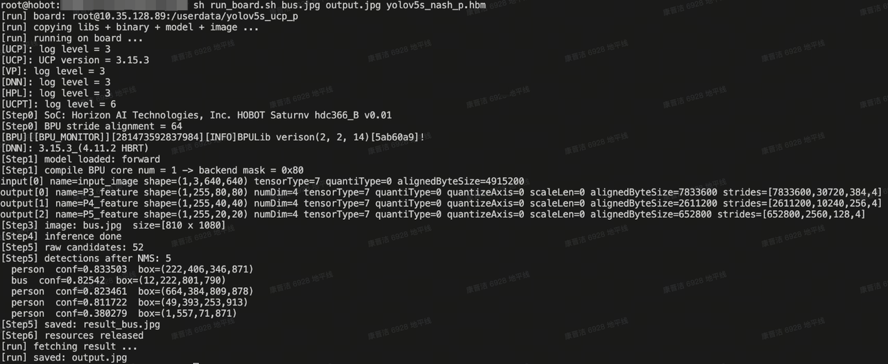

由于部分大模型上下文有限，而全流程部署场景的链路较长，可能存在超过上下文最大长度限制导致无法继续运行的问题。此外，若上下文过长，大模型有可能出现遗忘目标，执行摇摆不定，对异常过度反应，胡乱省略和幻觉增加等问题，因此大家常会发现在一条prompt里塞进过多任务时，agent往往会越跑越降智。为了提升使用效果，保证agent执行结果的准确性和稳定性，建议大家使用过程中应通过制定科学的计划，定期引导agent重新聚焦，并对关键步骤&配置做人工审核和确定。

如下分享我们采用分层规划再分阶段执行的方式，可显著提升agent对复杂任务的执行效果，同时让执行过程中人工更方便监督和纠偏，思路仅供参考，若有更好的方法欢迎大家多多分享互相借鉴：

1. 流程规划：引导agent参考oe-skills后仅列出 3\~5 个粗粒度的阶段，比如“环境搭建 -> 量化适配 -> 精度调优 -> 性能评测 -> 模型部署”。

2. 子阶段详细 Plan：每开始执行子阶段前，让agent依据顶层Plan，为该子阶段生成细化的子步骤。应要求其将执行过程做详细拆解，每一步聚焦一个关键动作，并列出具体参考的skill/文档，调用的关键api。

3. 分阶段执行：每个阶段单独开启一个会话，依据前一个阶段产出物和本阶段的计划进行执行，并要求每一步执行结束后写总结报告。

## 1. **流程规划**

```plain&#x20;text
你是一个任务规划专家。我会给你一个任务，请将达成该目标的过程拆分为 3~5 个阶段，每个阶段用一句话描述，无需给出子步骤和技术细节，但需要记录一些整个任务都要遵守的规则，输出格式为.md并存放到工作路径的子文件夹plan下面，便于后续阶段参照你的计划顺利开展。
任务描述：我想在地平线J6P平台上部署yolov5s，请帮我创建新的conda环境，模型量化（能进行calib，qat，export），精度调优，模型编译，hbm精度验证及ucp代码编写。
最终要求: hbm精度损失相较于浮点不超过1%，开发板10.xx.xx.xx实测延时控制在5ms内。
工作路径: /workspace/00_yolov5。部署相关产物请新建文件夹tmp_output存储，不要影响原代码。
工作环境：新建的conda环境,可以使用gpu卡3，4
校准数据集路径：/data/orig_data/mscoco/。
```

产出的部署计划中，应确认其包含正确的全局规则（应至少规定运行环境，工作路径，数据，任务目标，特殊的部署要求等）。其次，确认每个阶段的任务描述没有明显错误，如量化工具，量化基础配置，执行步骤等。

1. 量化工具：对于pytorch模型应使用horizon\_plugin\_pytorch做量化适配，不应由于任何异常回退到导出onnx走hmct量化，除非是用户授意允许。

2. 量化基础配置：J6E/M应为全int8，J6H/P应为fp16+int8

针对该提示词，拆解出了五个阶段：环境搭建，模型准备与 Plugin 量化适配，精度调优，导出编译与 HBM 精度验证，UCP 部署代码编写。

## 2. **子阶段详细 Plan**

```plain&#x20;text
依据顶层计划，参考.horizon/HORIZON.md依次拆解生成前每个阶段的详细子计划。子计划中每个步骤应是可立即执行的具体动作。要求：1. 步骤数量控制在 5~10 个 2.每步用一句话描述，只包含一个明确动作 3.需要包含应参考的skill或文档，以及使用的关键api。
OE开发包路径：/package/02_OE/horizon_j6_open_explorer_{version}
```

1. **环境搭建**

建议做如下检查：

1. pytorch量化的环境中除了浮点模型的必要依赖之外，应至少包含**量化工具**`horizon_plugin_pytorch` & `horizon_plugin_profiler`，**编译工具**`hbdk4-compiler`，**性能评测工具**`hbdk4-runtime`，hbm**精度评测工具**`hbm_infer`。查看agent计划安装的工具包，若其计划安装`horizon-tc-ui`等非必需安装包，提示其安装过程中若发现环境冲突应跳过安装，仅安装上必须的四个工具包即可。

2. `horizon_plugin_pytorch`支持的torch版本有限，当前OE开发包中仅提供了torch2.3/2.6/2.8/2.10.0的开发包，建议依据浮点模型要求，引导agent安装torch时限定在这四个版本内。

3. 当前OE仅支持python3.10和python3.11，确保agent安装conda环境时限定这两个版本。

4. **模型准备与 Plugin 量化适配**

对于量化适配，应检查计划中skill顺次调用了三个skill：量化适配`j6-plugin-adaptation`，适配检查`j6-plugin-model-check-result`，模型导出`j6-plugin-export`。

1. 量化适配`j6-plugin-adaptation`skill的内容简介：

这个skill下面有五个子skill：

2. 适配检查`j6-plugin-model-check-result`skill的内容简介：

该skill主要会做如下五个方面的异常检查：

3. 模型导出`j6-plugin-export`skill的内容简介：

该skill会构建一个独立的export.py，不在训练/评测脚本中添加导出逻辑，不改模型结构、不改 qconfig，加载前序步骤生成的量化权重。会在导出过程中检查模型正确包含FakeQuantize 模块。

5. **精度调优**

对于精度调优，应检查计划中的步骤是严格依据精度调优skill来展开的：



对于较为复杂的模型，当前还是需要注入一些人工配置（比如fix scale，fp32配置等），以避免自动调优浪费较多时间和token后难以得到一个可用的模型。

6. **导出编译与 HBM 精度验证**

**导出编译**：agent可能会选择`j6-plugin-hbdk-generating` 来帮忙生成基础的编译代码（默认全删量化反量化），但若您需要将输入改造成pyramid/resizer，或者进行一些比较复杂的节点删除任务（如全删量化节点，但homo-offset相关的不要改动），建议引导agent调用`j6-hbdk-compile`，可支持更复杂的编译场景。

**hbm精度验证**：若您没有可直连的开发板，或者是全量测试精度需要太长时间，可引导agent改用quantized.bc（与hbm输出二进制一致）跑几个关键case的可视化。若有可用的开发板，则agent会调用`j6-ucp-hbm-infer`编写hbm\_infer代码。

> 请注意，若开发板不可达，请不要让agent使用hbm\_infer在本地推理hbm，速度非常慢。

7. **UCP 部署代码编写**

部署代码编写流程里建议增加与python端的单张一致性验证（python端可使用quantized.bc或hbm\_infer，依据前一个流程决定）。

若无可使用的开发板，可引导agent基于quantized.bc，在x86端编译可执行程序进行ucp代码的正确性验证。

ucp代码生成调用的skill应为`j6-ucp-infer-generating`。

## 3. 分阶段执行

```plain&#x20;text
请参考项目计划：deployment_plan.md和阶段二的计划phase2_precision_tuning.md，完成模型精度调优。
```

具体执行阶段就不赘述了，最终经过3个小时agent完成了环境搭建，量化适配，精度调优，模型编译，hbm精度评测，部署代码生成，板端与x86端一致性验证等工作。






