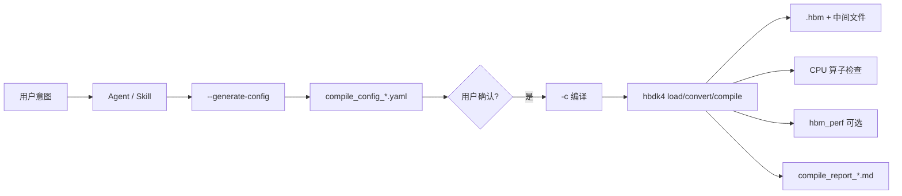

# j6-hbdk-compile 说明文档

> 对应 Skill 版本：**1.1.7**（以 `SKILL.md` 头部版本为准）  
> 文档目的：概括**核心能力**、**实现与流程设计**，以及**异常场景与兜底策略**，便于人工或 Agent 正确使用本技能与 `compile_model.py`。

---

## 1. 核心功能

### 1.1 定位

**j6-hbdk-compile** 是面向 Horizon J6 系列、基于 **YAML 配置驱动**的**通用模型编译** Agent Skill：将用户自然语言中的编译意图，转化为可复现的 `compile_config_*.yaml`，并在用户确认（默认门禁）后调用 `hbdk4` 完成 **convert → 删节点（可选）→ compile**，产出 **`.hbm`** 及配套日志、报告与可选 **hbm_perf** 结果。

### 1.2 能力清单

| 能力 | 说明 |
|------|------|
| 双格式模型 | 支持 **PTQ ONNX**（`.onnx`）与 **QAT BC**（`.bc`），在加载阶段执行**合法性校验**（见第 3 节）。 |
| 配置生成 | `--generate-config`：按模型路径自动创建 `compile_<timestamp>` 目录，并生成 `compile_config_<模型名>.yaml`。 |
| PTQ 配置导入 | `--ptq-config`：从 PTQ 的 `yaml` 映射 `march`、编译器参数、`input_sources`（含 mean/std 与预处理语义推断）。 |
| 输入源 | 支持 **ddr / pyramid / resizer**，通过 `insert_image_preprocess` 等路径配置；`data_type` 决定 YUV→RGB/BGR 等 mode。 |
| 节点策略 | `remove_node_type`（如 `Quantize`）、`preserve_*`、`remove_*_nodes` 等组合；对 pyramid/resizer 的派生边（如 `_y`/`_uv`）有**防误删**逻辑。 |
| 编译与产物 | `hbdk4.compiler.convert` / `compile`；中间产物含 `*_converted.bc/onnx`、`*_removed.bc/onnx`、`.hbm`、日志与 `compile_report_*.md`。 |
| 质量与性能 | 编译后 **CPU 算子检测**（`statistics` + `hbtl*` 前缀）；可选 **hbm_perf**（支持 `perf_ip` 远控开发板）。 |
| Docker 工作流 | 将同一份 `compile_model.py` 同步到用户指定目录，在容器内执行相同 CLI。 |

### 1.3 默认策略（Skill 约定）

- 目标平台默认 **`nash-e`**；输出目录为模型同级 **`compile_<timestamp>`**（防覆盖）。  
- 删 QDQ 推荐 **`remove_node_type: ["Quantize"]`**（`remove_all_qdq` 已废弃说明见 SKILL）。  
- **`debug: true`** 为默认。  
- **用户确认为先**：生成配置后**默认必须 Step 2 确认**，同一条用户消息中明确「直接编译/跳过确认」时方可连续执行（见 SKILL）。

---

## 2. 详细设计

### 2.1 总体架构



- **配置层**：YAML 完整描述 `model_path`、`march`、`output_dir`、`input_sources`、删节点策略、编译与 perf 参数。  
- **执行层**：`compile_model.py` 单入口（`click`），分 **生成配置** 与 **按配置编译** 两条路径；依赖 `hbdk4.compiler`（`load, convert, compile, statistics, hbm_perf, ...`）。  
- **交互层（Skill）**：规定 Step 1→7 的顺序与**确认门禁**，避免未审配置直接上板编译。

### 2.2 工作流（Step 1–7）

| Step | 名称 | 要点 |
|------|------|------|
| 0 | Docker 准备（可选） | 将 `compile_model.py` 写到 Docker 工作路径，后续命令均在容器内、该路径下执行。 |
| 1 | 解析并生成配置 | 提取模型路径、march、输入源、删节点、PTQ 路径等；执行 `compile_model.py --generate-config`（可加 `--ptq-config`），再按用户口令改 YAML。 |
| 2 | 用户确认 | **默认强门禁**：展示配置路径与关键字段摘要，**结束本轮等待用户**；不得擅自 `-c`。 |
| 3 | 执行编译 | `python compile_model.py -c <config>`：校验 → 打 IO → 配输入源 → convert → 删节点 → 再打 IO → compile → 打 HBM IO。 |
| 4 | CPU 算子 | `statistics(quantized_model)`，**列出全部 `hbtl*`**，并**询问用户是否继续**（不可只报「有 CPU 算子」）。 |
| 5 | 校验 HBM | 检查 `<model_name>.hbm` 存在且非空。 |
| 6 | hbm_perf | 有 `perf_ip` 则远控；否则本地/默认行为；产出 HTML 等。 |
| 7 | 编译报告 | 汇总配置、步骤、CPU 警告、产物、perf 路径、错误等至 `compile_report_*.md`。 |

### 2.3 模型加载与「阶段」判定（.bc / .onnx）

- **后缀**：仅 **`.onnx` / `.bc`**，否则 `ValueError` 终止。  
- **`.bc`**：  
  - `hbdk4.compiler.load` 失败 → 包装为 `RuntimeError`，提示与**导出时 hbdk4 版本**可能不一致。  
  - 成功 → 检查 inner module 的 **named attributes**：若存在 **`hbdk.target`**，则视为已 convert 的 **quantized.bc**，本流程要求 **qat.bc** → `RuntimeError` 终止。  
- **`.onnx`**：`onnx.load` 后图中须至少一个节点 **`op_type == "HzCalibration"`**（Horizon PTQ 标志），否则 `RuntimeError` 终止。  

`--generate-config` 与 `-c` 的 **load 路径使用相同校验**，避免「拉 IO 时松、编译时严」的不一致。

### 2.4 PTQ Config → 编译 YAML 映射（设计要点）

- **字段级映射**：`model_parameters.march`、`input_parameters.*`、`compiler_parameters.*` 等到 `march`、`input_sources[]`、`opt_level`、`core_num`、`jobs`、`cache_*` 等（完整表见 `SKILL.md`）。  
- **norm 推断**：**忽略** PTQ 里单独的 `norm_type`；由 `mean_value` / `scale_value` / `std_value` 组合推断 `data_mean_and_scale` 等语义。  
- **scale 与 std 互斥**；**不为缺失字段乱填默认预处理**（仅使用 PTQ 中提供的项）。  
- **公式**：PTQ 侧 `norm = (data - mean) * scale` 与 API 侧 `norm = (data - mean) / std` 的衔接为 **`std = 1 / scale_value`**（当使用 scale 时）。

### 2.5 节点删除与 pyramid/resizer 特化

- **`remove_node_type` 与 `remove_input_nodes/remove_output_nodes`** 存在**禁止组合**（见 `config_template.yaml` 注释），违反则 **ValueError** 终止，避免语义冲突。  
- 删除 `Quantize` 且存在 **`preserve_input_nodes`** 时：仅对**非保留**且**非** pyramid/resizer 图像源入边尝试删除；**派生名**如 `{根名}_y` / `{根名}_uv` 视为同一图像源，**不纳入误删名单**，避免 HBDK 报 *unremovable*。  
- 按名删 I/O 邻接算子时：若不可删，由抛错改为 **warning + 跳过该次删除**（见 CHANGELOG 1.1.3），避免整流程因单点拆图失败而崩溃。  
- **Pyramid/Resizer**：仅当输入为 **4 维** 时走 batch 拆分等逻辑；非 4 维 **warning 并跳过**相关分支，避免错误进入 `batch==1` 路径。

### 2.6 版本相关行为

- **`enable_hpc`**：需 **HBDK >= 4.9.2**（SKILL 中版本表）。  
- **QDQ 删除**：`func.remove_io_op()` 等 API 在 **>= 4.1.3** 与旧版路径上有分支；失败时可能 **warning 后回退旧方法**（见脚本中 `remove_io_op` 与 except 处理）。

### 2.7 产物与中间文件

| 文件 | 作用 |
|------|------|
| `compile_config_*.yaml` | 可复现配置 |
| `*_converted.bc` / `*_removed.bc` | 转换后、删节点后 BC |
| `*_converted.onnx` / `*_removed.onnx` | 可视化用（可不含大权重） |
| `*.hbm` | 上板/部署主产物 |
| `*.log` | 编译过程日志 |
| `compile_report_*.md` | 面向人的汇总报告 |
| hbm_perf 产出 | HTML 等（与 `output_dir`、function 名等相关） |

### 2.8 IO 打印约定

分三阶段打印：**原始图**（干净，无 [INFO]）→ **删节点后**（含 `quant_info`）→ **HBM**（含 `quant_info` 与 **strides**），便于对板与对图。

---

## 3. 异常与兜底方案

下表按**场景**分类，说明**预期行为**与**合规兜底**；Agent 侧**禁止**为绕开门禁而改校验代码或使用旁路加载脚本（见 SKILL 硬约束）。

### 3.1 环境与依赖

| 异常 | 表现 | 兜底/处理 |
|------|------|-----------|
| 缺少 `click` / `pyyaml` | 启动即提示安装并 `sys.exit(1)` | `pip install click pyyaml` |
| 未安装 `hbdk4` | 部分能力不可用；加载 `.bc`/编译会失败 | 在目标环境安装与模型导出一致或兼容的 **hbdk4**；勿绕过校验用假数据推进 |
| `packaging` 缺失 | 版本比较回退为简单 split 比较 | 一般可继续；必要时安装 `packaging` 以稳定版本比较 |

### 3.2 模型与配置合法性（硬停止，不「试编译」）

| 异常 | 兜底 |
|------|------|
| 文件不存在/路径错 | 检查路径、挂载与权限；修正后重跑 |
| 非 `.onnx`/`.bc` | 换用正确格式或先导出，**不**改后缀强行走流程 |
| `.bc` load 失败 | **对齐 hbdk4 与导出工具链版本**后重试 |
| `.bc` 为 quantized（含 `hbdk.target`） | 换 **qat.bc** 来源，从 QAT 阶段导出 |
| ONNX 无 `HzCalibration` | 使用 **horizon_plugin_pytorch 导出的 PTQ ONNX** |
| 配置为空/格式错 | 修正 YAML；无合法模型时可 `-o` 生成空模板**但不带 `-m`**，或先解决模型问题（见 SKILL） |
| 禁止的删节点组合 | 按 `config_template.yaml` 的「支持组合」改配 |

### 3.3 编译与图变换（可恢复/可降级部分）

| 异常 | 兜底 |
|------|------|
| `remove_io_op` 失败 | 脚本会 **warning 并尝试旧方法**（视版本与图结构） |
| 某 I/O 名删除失败 | **warning 跳过**该次删除；用户需结合可视化 ONNX 查图 |
| 可视化 ONNX 保存失败 | **warning，不影响**继续编译 HBM（若主流程已走到可写 HBM 阶段） |
| Pyramid/Resizer 与 shape 不兼容 | **warning 并跳过**非 4 维相关逻辑；需检查输入定义与 `source_type` 是否匹配 |
| 整体 `compile` 失败 | 日志 + traceback；据报错调整图、**march**、选项或 HBDK 版本，**不**应删断言重试 |

### 3.4 产物与后处理

| 异常 | 兜底 |
|------|------|
| `.hbm` 缺失或 0 字节 | 查 `*.log` 与 Step 3 错误；修配置或模型后重编 |
| 读取 HBM IO 失败 | **warning**；人工用其它工具再验板侧布局 |
| `hbm_perf` 未执行 | `hbdk4` 未装时**跳过**；网络/远控问题见 **error 日志** |
| `hbm_perf` 抛错 | 记录于日志；可暂时去掉 `perf_ip` 作本地/默认尝试，或检查板子连通与权限 |

### 3.5 CPU 算子（非致命，需人机协同）

- 检测到 **`hbtl*`**：Skill 要求 **逐条列出算子名**并**询问是否继续**——不自动忽略，也不应静默。  
- **兜底**：若业务允许上板验证，可确认后继续；若需消除 CPU 算子，需回模型/算子库侧优化（本 Skill 不替代算子实现变更）。

### 3.6 用户交互与流程兜底

- **未确认就编译**：属流程错误；应回到 Step 2 展示配置并取得明确肯定。  
- **缺模型路径、mean/std 等与用户描述冲突**：须**单独确认**，不得替用户默认。  
- **用户取消**：不执行 `-c`，可保留已生成 yaml 供下次使用。

---

## 4. 命令速查

```bash
# 生成配置（推荐带模型，自动建 compile_<ts> 目录）
python /path/to/compile_model.py --generate-config -m <model_path>

# 加 PTQ 配置导入
python /path/to/compile_model.py --generate-config -m <model_path> --ptq-config <ptq.yaml>

# 指定输出 yaml 路径
python /path/to/compile_model.py --generate-config -m <model_path> -o my_config.yaml

# 按配置编译
python /path/to/compile_model.py -c <config_path>
```

Skill 内默认脚本位置：`~/.claude/skills/j6-hbdk-compile/compile_model.py`（与 `SKILL.md`、`config_template.yaml` 同目录）。

---

## 5. 相关文件

| 文件 | 作用 |
|------|------|
| `SKILL.md` | 权威交互规则、参数表、触发词、Docker 说明 |
| `compile_model.py` | 实现与校验、编译主流程 |
| `config_template.yaml` | 生成配置时的模板与**禁止组合**说明 |
| `CHANGELOG.md` | 版本与行为变更史 |

---

## 6. 修订说明

- 当 `SKILL.md` 版本号或「硬门禁/禁止事项」更新时，请同步核对本说明文档**第 1、2.3、3.2 节**是否与之一致。  
- 本说明不替代 **HORIZON 官方**对 `hbdk4` API/CLI 的逐条说明；遇工具链级疑问请查阅项目内 `oe_docs` / `HORIZON.md` 等权威文档（若适用 Agent 工作区规则）。
